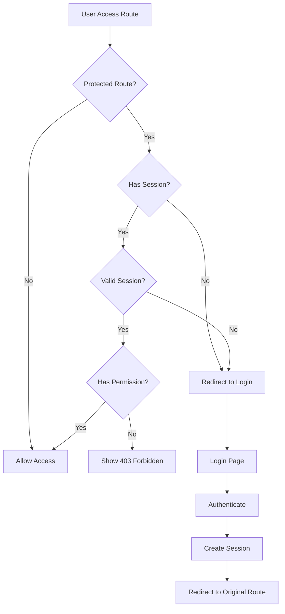

# THub V2 Route Documentation

**Version**: 1.0.0  
**Last Updated**: January 19, 2025  
**Framework**: Next.js 14 App Router

## Table of Contents

1. [Route Structure Overview](#route-structure-overview)
2. [Public Routes](#public-routes)
3. [Authentication Routes](#authentication-routes)
4. [Dashboard Routes](#dashboard-routes)
5. [API Routes](#api-routes)
6. [Middleware & Protection](#middleware--protection)
7. [Route Patterns & Best Practices](#route-patterns--best-practices)

---

## Route Structure Overview

The application uses Next.js 14 App Router with the following structure:

```
/src/app/
├── (auth)/                  # Authentication route group
├── (dashboard)/            # Protected dashboard routes
├── api/                    # API endpoints
├── showcase/               # Component showcase
├── layout.tsx              # Root layout
└── page.tsx                # Landing page
```

### Route Groups

- **(auth)**: Grouped authentication-related pages
- **(dashboard)**: Grouped protected dashboard pages

Route groups allow organizing routes without affecting the URL structure.

---

## Public Routes

### Landing Page
**Route**: `/`  
**File**: `/src/app/page.tsx`  
**Description**: Main landing page with product information

```typescript
// Key Features:
- Hero section with CTA
- Feature highlights
- Pricing information
- Testimonials
- Footer with links
```

### Component Showcase
**Route**: `/showcase`  
**File**: `/src/app/showcase/page.tsx`  
**Description**: Interactive component demonstration

```typescript
// Showcases:
- All UI components
- Glassmorphism effects
- Interactive examples
- Code snippets
- Mobile responsiveness
```

---

## Authentication Routes

### Login Page
**Route**: `/login`  
**File**: `/src/app/(auth)/login/page.tsx`  
**Description**: User authentication

```typescript
interface LoginPageFeatures {
  emailPassword: boolean      // Email/password login
  socialLogin: boolean        // OAuth providers
  biometric: boolean          // Touch/Face ID
  twoFactor: boolean          // 2FA support
  rememberMe: boolean         // Session persistence
}
```

### Registration Page
**Route**: `/register`  
**File**: `/src/app/(auth)/register/page.tsx`  
**Description**: New user registration

```typescript
interface RegistrationFlow {
  steps: [
    'email_verification',
    'personal_details',
    'preferences',
    'subscription'
  ]
  validation: 'real-time'
  passwordStrength: 'required'
}
```

### Password Reset
**Route**: `/forgot-password`  
**File**: `/src/app/(auth)/forgot-password/page.tsx`  
**Description**: Password recovery flow

```typescript
// Flow:
1. Enter email
2. Receive reset token
3. Redirect to reset page
4. Set new password
```

### Email Verification
**Route**: `/verify-email`  
**File**: `/src/app/(auth)/verify-email/page.tsx`  
**Query Parameters**: `?token=xxx`  
**Description**: Email verification handler

---

## Dashboard Routes

### Dashboard Layout
**File**: `/src/app/(dashboard)/layout.tsx`  
**Features**:
- Sidebar navigation
- Header with user profile
- Mobile bottom navigation
- Real-time connection status

### Main Dashboard
**Route**: `/dashboard`  
**File**: `/src/app/(dashboard)/dashboard/page.tsx`  
**Description**: Overview dashboard with key metrics

```typescript
interface DashboardComponents {
  statsGrid: {
    activeSignals: number
    successRate: number
    totalProfit: number
    avgReturn: number
  }
  recentSignals: Signal[]
  marketOverview: MarketIndex[]
  activityFeed: Activity[]
}
```

### Trading Signals
**Route**: `/signals`  
**File**: `/src/app/(dashboard)/signals/page.tsx`  
**Description**: Real-time trading signals with filtering

```typescript
interface SignalsPageFeatures {
  filters: {
    signalStrength: string[]
    scoreRange: [number, number]
    timeframe: string
    symbol: string
  }
  sorting: {
    by: 'score' | 'time' | 'price_change' | 'volume'
    order: 'asc' | 'desc'
  }
  realTime: boolean
  pagination: boolean
}
```

### Portfolio Management
**Route**: `/portfolio` (planned)  
**File**: `/src/app/(dashboard)/portfolio/page.tsx`  
**Description**: Portfolio tracking and management

### Market Analysis
**Route**: `/analysis` (planned)  
**File**: `/src/app/(dashboard)/analysis/page.tsx`  
**Description**: Deep market analysis tools

### Settings
**Route**: `/settings` (planned)  
**File**: `/src/app/(dashboard)/settings/page.tsx`  
**Description**: User preferences and account settings

### Developer Tools
**Route**: `/dev/testing`  
**File**: `/src/app/(dashboard)/dev/testing/page.tsx`  
**Description**: Performance testing interface

```typescript
interface DevToolsFeatures {
  fpsMonitor: boolean
  performanceProfiler: boolean
  networkMonitor: boolean
  componentInspector: boolean
  stateDebugger: boolean
}
```

---

## API Routes

### Health Check Endpoints

#### System Health
**Route**: `GET /api/health`  
**Response**:
```json
{
  "status": "healthy",
  "version": "1.0.0",
  "timestamp": "2025-01-19T12:00:00Z",
  "services": {
    "database": "connected",
    "cache": "connected",
    "websocket": "connected"
  }
}
```

#### Market Data Health
**Route**: `GET /api/health/market-data`  
**Response**:
```json
{
  "status": "healthy",
  "provider": "EODHD",
  "apiCalls": {
    "minute": { "used": 45, "limit": 600 },
    "daily": { "used": 12500, "limit": 100000 }
  },
  "lastSync": "2025-01-19T11:59:00Z"
}
```

### Webhook Endpoints

#### n8n Trading Analysis
**Route**: `POST /api/webhooks/n8n`  
**Authentication**: Bearer token  
**Rate Limit**: 10 requests/minute  

**Actions**:
1. **analyze** - Single symbol analysis
2. **batch_analyze** - Multiple symbols (max 50)
3. **market_overview** - Market summary
4. **market_scan** - Full market scan with filters

**Request Example**:
```typescript
POST /api/webhooks/n8n
Authorization: Bearer YOUR_SECRET

{
  "action": "batch_analyze",
  "symbols": ["AAPL", "MSFT", "GOOGL"],
  "priority": "high",
  "metadata": {
    "source": "manual_trigger",
    "user": "system"
  }
}
```

### Authentication Test
**Route**: `GET /api/auth/test`  
**File**: `/src/app/api/auth/test/route.ts`  
**Description**: Test authentication status

### Test Analysis (Development)
**Route**: `POST /api/test-analysis`  
**File**: `/src/app/api/test-analysis/route.ts`  
**Description**: Test signal analysis endpoint

---

## Middleware & Protection

### Route Protection Strategy

```typescript
// middleware.ts (conceptual implementation)
import { NextResponse } from 'next/server'
import type { NextRequest } from 'next/server'

export function middleware(request: NextRequest) {
  const { pathname } = request.nextUrl
  
  // Protected route patterns
  const protectedRoutes = [
    '/dashboard',
    '/signals',
    '/portfolio',
    '/analysis',
    '/settings'
  ]
  
  // Check if route needs protection
  const isProtectedRoute = protectedRoutes.some(route => 
    pathname.startsWith(route)
  )
  
  if (isProtectedRoute) {
    const session = request.cookies.get('session')
    
    if (!session) {
      // Redirect to login with return URL
      const url = new URL('/login', request.url)
      url.searchParams.set('from', pathname)
      return NextResponse.redirect(url)
    }
    
    // Verify session validity
    // Add role-based access control
  }
  
  return NextResponse.next()
}

export const config = {
  matcher: [
    '/((?!api|_next/static|_next/image|favicon.ico).*)',
  ],
}
```

### Authentication Flow



---

## Route Patterns & Best Practices

### Naming Conventions

```typescript
// Pages
/dashboard              // Noun for resource listing
/signals               // Plural for collections
/signals/[id]          // Dynamic segment for details
/settings/profile      // Nested for sub-sections

// API Routes
/api/signals           // RESTful resource naming
/api/signals/[id]      // Single resource
/api/webhooks/n8n      // Integration-specific
/api/auth/login        // Action-based naming
```

### Dynamic Routes (Planned)

```typescript
// Signal Details
/signals/[id]
- Show full signal analysis
- Historical performance
- Similar signals
- Action buttons

// Portfolio Details
/portfolio/[portfolioId]
- Position details
- Performance metrics
- Transaction history

// Symbol Analysis
/analysis/[symbol]
- Technical analysis
- News sentiment
- Price predictions
```

### Route Organization

```typescript
// Group related routes
(auth)/
  login/
  register/
  forgot-password/
  verify-email/

// Separate concerns
(dashboard)/        // User area
(admin)/           // Admin area (future)
(api)/             // API routes
```

### Loading & Error States

```typescript
// loading.tsx - Show while loading
export default function Loading() {
  return <DashboardSkeleton />
}

// error.tsx - Error boundary
export default function Error({
  error,
  reset,
}: {
  error: Error
  reset: () => void
}) {
  return <ErrorBoundary error={error} reset={reset} />
}

// not-found.tsx - 404 handler
export default function NotFound() {
  return <Custom404Page />
}
```

### SEO & Metadata

```typescript
// Static metadata
export const metadata = {
  title: 'Trading Signals - THub V2',
  description: 'Real-time AI-powered trading signals',
}

// Dynamic metadata
export async function generateMetadata({ params }) {
  const signal = await getSignal(params.id)
  
  return {
    title: `${signal.symbol} Signal - THub V2`,
    description: signal.analysis_summary,
  }
}
```

### Performance Optimization

```typescript
// Parallel data fetching
async function DashboardPage() {
  // Fetch in parallel
  const [stats, signals, indices] = await Promise.all([
    getDashboardStats(),
    getRecentSignals(),
    getMarketIndices()
  ])
  
  return <Dashboard {...{ stats, signals, indices }} />
}

// Streaming SSR
import { Suspense } from 'react'

export default function Page() {
  return (
    <>
      <Header />
      <Suspense fallback={<StatsSkeleton />}>
        <Stats />
      </Suspense>
      <Suspense fallback={<SignalsSkeleton />}>
        <Signals />
      </Suspense>
    </>
  )
}
```

### Route Transitions

```typescript
// Smooth page transitions
'use client'

import { useRouter } from 'next/navigation'
import { startTransition } from 'react'

function NavigationLink({ href, children }) {
  const router = useRouter()
  
  const handleClick = (e) => {
    e.preventDefault()
    startTransition(() => {
      router.push(href)
    })
  }
  
  return (
    <a href={href} onClick={handleClick}>
      {children}
    </a>
  )
}
```

---

## Future Routes

### Planned Additions

1. **Individual Signal Pages**
   - `/signals/[id]` - Detailed signal view
   - `/signals/[id]/performance` - Historical performance
   - `/signals/[id]/similar` - Related signals

2. **Portfolio Management**
   - `/portfolio` - Portfolio overview
   - `/portfolio/[id]` - Individual portfolio
   - `/portfolio/create` - New portfolio
   - `/portfolio/[id]/transactions` - Transaction history

3. **Market Analysis**
   - `/analysis` - Analysis dashboard
   - `/analysis/[symbol]` - Symbol analysis
   - `/analysis/screener` - Stock screener
   - `/analysis/heatmap` - Market heatmap

4. **User Account**
   - `/settings` - Account settings
   - `/settings/profile` - Profile management
   - `/settings/billing` - Subscription management
   - `/settings/api` - API key management

5. **Admin Panel**
   - `/admin` - Admin dashboard
   - `/admin/users` - User management
   - `/admin/signals` - Signal moderation
   - `/admin/analytics` - Platform analytics

---

**Document Version**: 1.0.0  
**Last Updated**: January 19, 2025  
**Next Review**: After route implementation