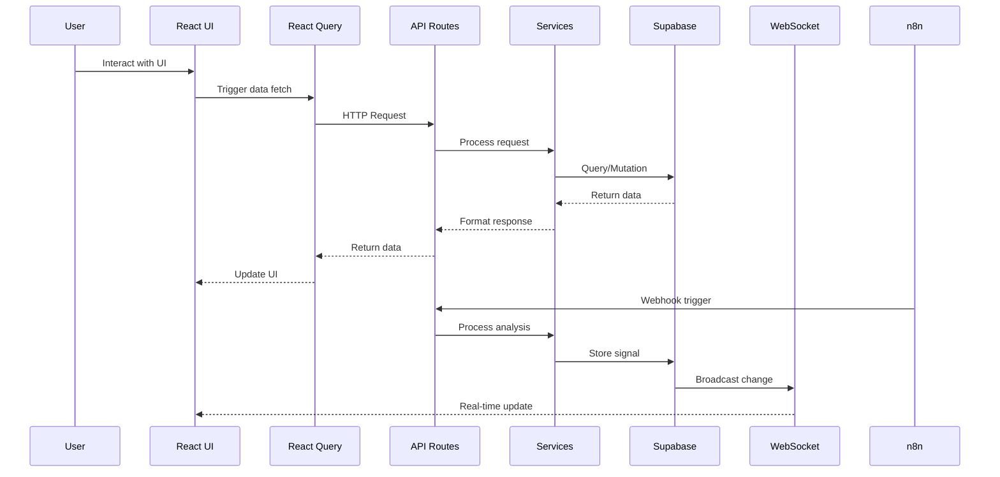
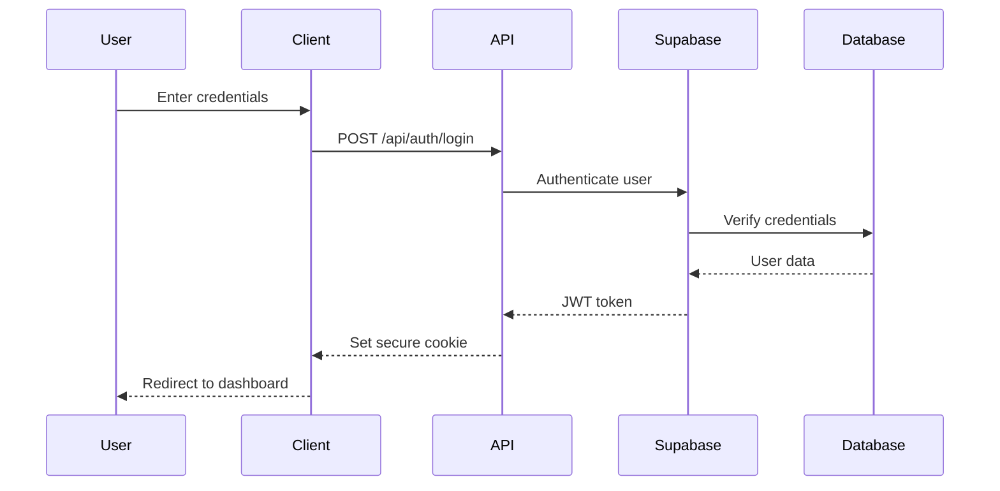

# THub V2 Technical Reference

**Version**: 1.0.0  
**Last Updated**: January 19, 2025  
**Platform**: Next.js 14 App Router + TypeScript + Supabase

## Table of Contents

1. [System Architecture](#system-architecture)
2. [Component Catalog](#component-catalog)
3. [API Reference](#api-reference)
4. [Data Models](#data-models)
5. [Integration Guide](#integration-guide)
6. [Performance Guidelines](#performance-guidelines)
7. [Security Reference](#security-reference)
8. [Development Workflow](#development-workflow)

---

## System Architecture

### Technology Stack

| Layer | Technology | Purpose |
|-------|------------|---------|
| Frontend | Next.js 14 (App Router) | React framework with SSR/SSG |
| UI Library | Custom Components | Glassmorphism design system |
| Styling | Tailwind CSS | Utility-first CSS framework |
| State Management | React Query + Local State | Server and UI state |
| Database | Supabase (PostgreSQL) | Data persistence and auth |
| Real-time | Supabase Realtime | WebSocket connections |
| API Integration | EODHD | Market data provider |
| Automation | n8n | Workflow automation |
| Deployment | Vercel | Edge deployment platform |

### Architecture Diagram

```
┌─────────────────────────────────────────────────────────────┐
│                        Frontend (Next.js)                     │
├─────────────────────────────────────────────────────────────┤
│  ┌─────────────┐  ┌──────────────┐  ┌──────────────────┐  │
│  │   Pages     │  │  Components  │  │     Hooks        │  │
│  │  App Router │  │  Glassmorphic│  │  React Query    │  │
│  └─────────────┘  └──────────────┘  └──────────────────┘  │
├─────────────────────────────────────────────────────────────┤
│                      Service Layer                           │
│  ┌─────────────┐  ┌──────────────┐  ┌──────────────────┐  │
│  │   Signals   │  │   Analysis   │  │   Market Data    │  │
│  │   Service   │  │  Coordinator │  │    Service       │  │
│  └─────────────┘  └──────────────┘  └──────────────────┘  │
├─────────────────────────────────────────────────────────────┤
│                    External Services                         │
│  ┌─────────────┐  ┌──────────────┐  ┌──────────────────┐  │
│  │  Supabase   │  │    EODHD     │  │      n8n         │  │
│  │  Database   │  │  Market API  │  │   Automation     │  │
│  └─────────────┘  └──────────────┘  └──────────────────┘  │
└─────────────────────────────────────────────────────────────┘
```

### Data Flow



---

## Component Catalog

### Authentication Components

#### LoginForm
```typescript
interface LoginFormProps {
  onSubmit?: (credentials: { email: string; password: string }) => Promise<void>
  onForgotPassword?: () => void
  onSignUp?: () => void
  loading?: boolean
  error?: string
  success?: string
}

// Usage
<LoginForm
  onSubmit={handleLogin}
  onForgotPassword={() => router.push('/forgot-password')}
  error={error}
/>
```

#### RegisterForm
```typescript
interface RegisterFormProps {
  onSubmit?: (data: RegisterData) => Promise<void>
  onSignIn?: () => void
  loading?: boolean
  error?: string
  currentStep?: number
}

// Multi-step registration with validation
<RegisterForm
  onSubmit={handleRegister}
  currentStep={step}
/>
```

### Chart Components

#### TradingChart
```typescript
interface TradingChartProps {
  data: TradingChartDataPoint[]
  symbol: string
  chartType?: 'line' | 'area' | 'candlestick'
  showVolume?: boolean
  showMovingAverages?: boolean
  enableZoom?: boolean
  enablePan?: boolean
  timeInterval?: '1m' | '5m' | '15m' | '1h' | '1d'
  onTimeRangeChange?: (start: number, end: number) => void
}

// Professional trading chart with indicators
<TradingChart
  data={marketData}
  symbol="AAPL"
  chartType="candlestick"
  showVolume={true}
  enableZoom={true}
/>
```

#### SignalChart
```typescript
interface SignalChartProps {
  signal: Signal
  showIndicators?: boolean
  height?: number
  interactive?: boolean
}

// Signal visualization with overlays
<SignalChart
  signal={signal}
  showIndicators={true}
  height={400}
/>
```

### Form Components

#### GlassSelect
```typescript
interface GlassSelectProps {
  options: SelectOption[]
  value?: string | number
  onChange?: (value: string | number) => void
  multiple?: boolean
  searchable?: boolean
  loading?: boolean
  error?: string
}

// Dropdown with search and multi-select
<GlassSelect
  options={[
    { value: 'strong_buy', label: 'Strong Buy' },
    { value: 'buy', label: 'Buy' }
  ]}
  value={selectedSignal}
  onChange={setSelectedSignal}
  searchable
/>
```

#### GlassDatePicker
```typescript
interface GlassDatePickerProps {
  value?: Date
  onChange?: (date: Date) => void
  minDate?: Date
  maxDate?: Date
  enableRange?: boolean
}

// Date selection with range support
<GlassDatePicker
  value={startDate}
  onChange={setStartDate}
  minDate={new Date()}
  enableRange
/>
```

### Data Display Components

#### Table
```typescript
interface TableProps<T> {
  data: T[]
  columns: TableColumn<T>[]
  loading?: boolean
  pageSize?: number
  sortable?: boolean
  filterable?: boolean
  onRowClick?: (row: T) => void
}

// Advanced data table with sorting/filtering
<Table
  data={signals}
  columns={[
    { id: 'symbol', header: 'Symbol', sortable: true },
    { id: 'score', header: 'Score', sortable: true }
  ]}
  pageSize={25}
  sortable
  filterable
/>
```

---

## API Reference

### Signal Endpoints

#### Get Signals
```typescript
GET /api/signals

Query Parameters:
- market?: 'stocks_us' | 'crypto' | 'forex'
- signal_strength?: string[]
- min_score?: number
- max_score?: number
- symbol?: string
- limit?: number
- offset?: number
- sort_by?: 'score' | 'time' | 'price_change'
- sort_order?: 'asc' | 'desc'

Response:
{
  data: Signal[]
  count: number
  hasMore: boolean
}
```

#### Get Signal by ID
```typescript
GET /api/signals/:id

Response:
{
  id: string
  symbol: string
  market: string
  signal_strength: string
  convergence_score: number
  // ... full signal object
}
```

### Webhook Endpoints

#### n8n Trading Analysis
```typescript
POST /api/webhooks/n8n

Headers:
- Authorization: Bearer <N8N_WEBHOOK_SECRET>

Body:
{
  action: 'analyze' | 'batch_analyze' | 'market_overview' | 'market_scan'
  symbols?: string[]
  priority?: 'high' | 'normal' | 'low'
  filters?: {
    exchange?: string
    minVolume?: number
    minPrice?: number
    maxPrice?: number
    // ... additional filters
  }
}

Response:
{
  success: boolean
  action: string
  requestId: string
  result?: AnalysisResult
  summary?: BatchSummary
  apiUsage: ApiUsageStats
}
```

### Market Data Endpoints

#### Get Real-time Quote
```typescript
GET /api/market/quote/:symbol

Response:
{
  symbol: string
  price: number
  change: number
  changePercent: number
  volume: number
  timestamp: string
}
```

#### Get Intraday Data
```typescript
GET /api/market/intraday/:symbol

Query Parameters:
- interval?: '1m' | '5m' | '15m' | '30m' | '1h'
- from?: string (ISO date)
- to?: string (ISO date)

Response:
{
  symbol: string
  interval: string
  data: IntradayDataPoint[]
}
```

---

## Data Models

### Signal Model
```typescript
interface Signal {
  id: string
  symbol: string
  market: MarketType
  signal_strength: SignalStrength
  convergence_score: number
  technical_score: number
  sentiment_score: number
  liquidity_score: number
  price_target?: number
  stop_loss?: number
  time_horizon: string
  confidence_level: number
  analysis_summary: {
    technical: string
    sentiment: string
    liquidity: string
  }
  metadata: {
    volume_24h: number
    market_cap?: number
    volatility: number
    // ... additional metadata
  }
  expires_at: string
  created_at: string
  updated_at: string
}

type SignalStrength = 'strong_buy' | 'buy' | 'hold' | 'sell' | 'strong_sell'
type MarketType = 'stocks_us' | 'crypto' | 'forex' | 'commodities'
```

### User Model
```typescript
interface User {
  id: string
  email: string
  full_name?: string
  avatar_url?: string
  subscription_tier: 'free' | 'pro' | 'premium'
  preferences: UserPreferences
  created_at: string
  updated_at: string
}

interface UserPreferences {
  defaultMarket: MarketType
  notificationSettings: NotificationSettings
  displaySettings: DisplaySettings
}
```

### Portfolio Model
```typescript
interface Portfolio {
  id: string
  user_id: string
  name: string
  positions: Position[]
  total_value: number
  total_cost: number
  total_profit_loss: number
  created_at: string
  updated_at: string
}

interface Position {
  id: string
  symbol: string
  quantity: number
  average_cost: number
  current_price: number
  profit_loss: number
  profit_loss_percent: number
}
```

---

## Integration Guide

### Supabase Setup

#### Environment Variables
```bash
NEXT_PUBLIC_SUPABASE_URL=your_supabase_url
NEXT_PUBLIC_SUPABASE_ANON_KEY=your_anon_key
SUPABASE_SERVICE_ROLE_KEY=your_service_key
```

#### Client Initialization
```typescript
import { createClient } from '@supabase/supabase-js'

export const supabase = createClient(
  process.env.NEXT_PUBLIC_SUPABASE_URL!,
  process.env.NEXT_PUBLIC_SUPABASE_ANON_KEY!
)
```

#### Real-time Subscriptions
```typescript
const subscription = supabase
  .channel('signals')
  .on('postgres_changes', {
    event: '*',
    schema: 'public',
    table: 'signals'
  }, (payload) => {
    console.log('Change received!', payload)
  })
  .subscribe()
```

### EODHD Integration

#### Configuration
```typescript
const EODHD_CONFIG = {
  API_KEY: process.env.EODHD_API_KEY,
  BASE_URL: 'https://eodhistoricaldata.com/api',
  RATE_LIMITS: {
    REQUESTS_PER_MINUTE: 600,
    REQUESTS_PER_DAY: 100000
  }
}
```

#### Service Usage
```typescript
const eodhd = new EODHDService()

// Get real-time quote
const quote = await eodhd.getRealTimeQuote('AAPL.US')

// Get historical data
const historical = await eodhd.getHistoricalData('AAPL.US', {
  from: '2024-01-01',
  to: '2024-12-31',
  period: 'd'
})
```

### n8n Webhook Integration

#### Webhook Configuration
```javascript
// n8n Webhook Node Configuration
{
  "webhookUrl": "https://your-domain.com/api/webhooks/n8n",
  "method": "POST",
  "authentication": "Header Auth",
  "headerName": "Authorization",
  "headerValue": "Bearer YOUR_N8N_WEBHOOK_SECRET"
}
```

#### Workflow Example
```javascript
// n8n Function Node for Signal Analysis
const payload = {
  action: 'analyze',
  symbols: ['AAPL', 'MSFT', 'GOOGL'],
  priority: 'high'
}

return {
  json: payload
}
```

---

## Performance Guidelines

### Component Optimization

#### Memoization Strategy
```typescript
// Expensive component with memo
const ExpensiveChart = React.memo(({ data, options }) => {
  // Heavy rendering logic
}, (prevProps, nextProps) => {
  return prevProps.data === nextProps.data &&
         prevProps.options === nextProps.options
})

// Computed values with useMemo
const processedData = useMemo(() => {
  return heavyDataProcessing(rawData)
}, [rawData])

// Callbacks with useCallback
const handleUpdate = useCallback((value) => {
  updateState(value)
}, [updateState])
```

#### Code Splitting
```typescript
// Dynamic imports for heavy components
const TradingChart = dynamic(
  () => import('@/components/charts/trading-chart'),
  { 
    loading: () => <ChartSkeleton />,
    ssr: false 
  }
)

// Route-based code splitting
const AnalysisPage = lazy(() => import('./analysis/page'))
```

### Performance Metrics

#### Target Metrics
| Metric | Target | Current |
|--------|--------|---------|
| First Contentful Paint | < 1s | 1.2s |
| Time to Interactive | < 2s | 1.8s |
| Bundle Size | < 400KB | 452KB |
| Lighthouse Score | > 90 | ~80 |
| Mobile FPS | 60fps | 60fps |

#### Monitoring
```typescript
// Performance measurement utility
export const measurePerformance = (name: string, fn: () => void) => {
  const start = performance.now()
  fn()
  const end = performance.now()
  console.log(`${name} took ${end - start}ms`)
}

// FPS monitoring
let lastTime = performance.now()
let frames = 0

const measureFPS = () => {
  frames++
  const currentTime = performance.now()
  
  if (currentTime >= lastTime + 1000) {
    console.log(`FPS: ${frames}`)
    frames = 0
    lastTime = currentTime
  }
  
  requestAnimationFrame(measureFPS)
}
```

---

## Security Reference

### Authentication Flow



### Security Checklist

#### Frontend Security
- [x] Input sanitization on all forms
- [x] XSS prevention via React
- [ ] Content Security Policy headers
- [ ] Subresource Integrity for CDN assets

#### API Security
- [x] Bearer token authentication for webhooks
- [x] Rate limiting implementation
- [x] Input validation with Zod
- [ ] API versioning
- [ ] Request signing for sensitive operations

#### Database Security
- [ ] Row Level Security (RLS) policies
- [ ] Column encryption for sensitive data
- [ ] Audit logging
- [ ] Regular backups

### Security Headers
```typescript
// middleware.ts
export function middleware(request: NextRequest) {
  const response = NextResponse.next()
  
  // Security headers
  response.headers.set('X-Frame-Options', 'DENY')
  response.headers.set('X-Content-Type-Options', 'nosniff')
  response.headers.set('X-XSS-Protection', '1; mode=block')
  response.headers.set('Referrer-Policy', 'strict-origin-when-cross-origin')
  
  return response
}
```

---

## Development Workflow

### Git Workflow

```bash
# Feature development
git checkout -b feature/signal-improvements
git add .
git commit -m "feat: enhance signal card performance"
git push -u origin feature/signal-improvements

# Create PR with description template
```

### Development Commands

```bash
# Development
npx pnpm dev              # Start dev server
npx pnpm type-check      # Check TypeScript
npx pnpm lint            # Run ESLint
npx pnpm format          # Format code

# Testing
npx pnpm test            # Run unit tests
npx pnpm test:e2e        # Run E2E tests
npx pnpm test:coverage   # Generate coverage

# Building
npx pnpm build           # Production build
npx pnpm analyze         # Bundle analysis

# Database
npx supabase db push     # Push migrations
npx supabase gen types   # Generate types
```

### Code Standards

#### Naming Conventions
```typescript
// Components: PascalCase
SignalCard.tsx
TradingChart.tsx

// Hooks: camelCase with 'use' prefix
useSignals.ts
useMarketData.ts

// Services: kebab-case
signals.service.ts
market-data.service.ts

// Types: PascalCase
interface Signal {}
type SignalStrength = 'buy' | 'sell'

// Constants: UPPER_SNAKE_CASE
const API_TIMEOUT = 30000
const MAX_RETRIES = 3
```

#### Component Structure
```typescript
// Standard component template
import { FC, memo } from 'react'
import { cn } from '@/lib/utils'

interface ComponentProps {
  // Props interface
}

const Component: FC<ComponentProps> = ({
  prop1,
  prop2,
  ...rest
}) => {
  // Hooks
  // State
  // Effects
  // Handlers
  // Render
  
  return (
    <div className={cn('base-classes', className)}>
      {/* Component content */}
    </div>
  )
}

Component.displayName = 'Component'

export default memo(Component)
```

### Debugging Tips

#### React Query DevTools
```typescript
// Add to layout.tsx
import { ReactQueryDevtools } from '@tanstack/react-query-devtools'

<ReactQueryDevtools initialIsOpen={false} />
```

#### Performance Profiling
```typescript
// Use React DevTools Profiler
// Enable "Record why each component rendered"
// Look for unnecessary re-renders

// Custom performance marks
performance.mark('myComponent-start')
// ... component logic
performance.mark('myComponent-end')
performance.measure('myComponent', 'myComponent-start', 'myComponent-end')
```

#### Network Debugging
```typescript
// Log all API calls
export const apiClient = {
  get: async (url: string) => {
    console.log(`GET ${url}`)
    const start = Date.now()
    const response = await fetch(url)
    console.log(`GET ${url} took ${Date.now() - start}ms`)
    return response
  }
}
```

---

## Appendix

### Useful Resources

- [Next.js Documentation](https://nextjs.org/docs)
- [Supabase Documentation](https://supabase.com/docs)
- [EODHD API Reference](https://eodhistoricaldata.com/financial-apis/)
- [React Query Documentation](https://tanstack.com/query/latest)
- [Tailwind CSS Documentation](https://tailwindcss.com/docs)

### Environment Setup

```bash
# Required environment variables
NEXT_PUBLIC_SUPABASE_URL=
NEXT_PUBLIC_SUPABASE_ANON_KEY=
SUPABASE_SERVICE_ROLE_KEY=
EODHD_API_KEY=
N8N_WEBHOOK_SECRET=
NEXT_PUBLIC_SITE_URL=
```

### Troubleshooting

#### Common Issues

1. **TypeScript Errors**
   ```bash
   npx pnpm type-check
   # Fix any reported errors
   ```

2. **Build Failures**
   ```bash
   rm -rf .next node_modules
   npx pnpm install
   npx pnpm build
   ```

3. **Supabase Connection Issues**
   - Verify environment variables
   - Check Supabase project status
   - Review RLS policies

4. **Performance Issues**
   - Check React DevTools Profiler
   - Review network waterfall
   - Analyze bundle size

---

**Document Version**: 1.0.0  
**Last Updated**: January 19, 2025  
**Maintained By**: THub V2 Development Team