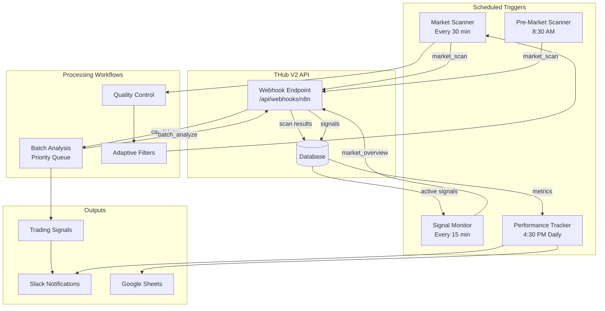
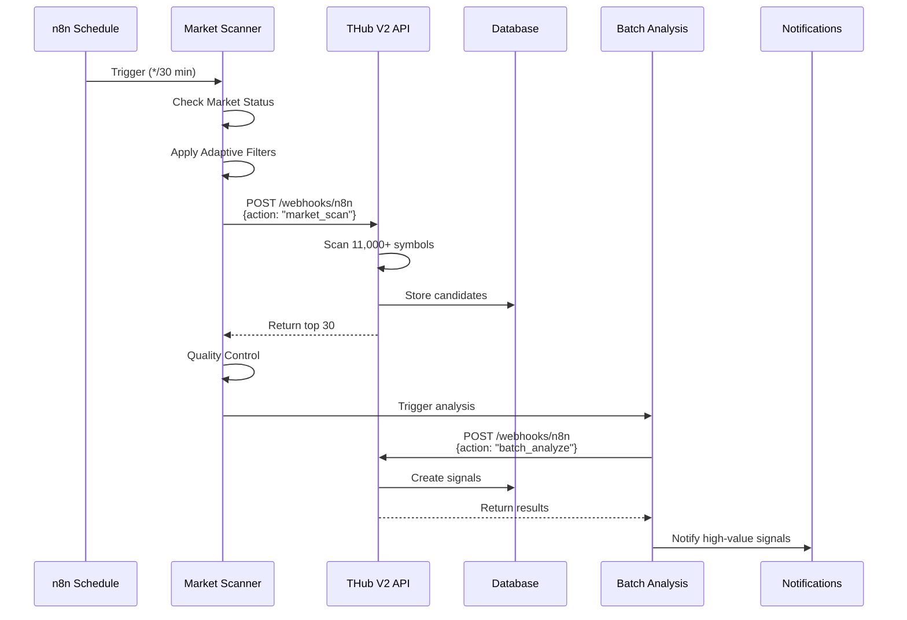
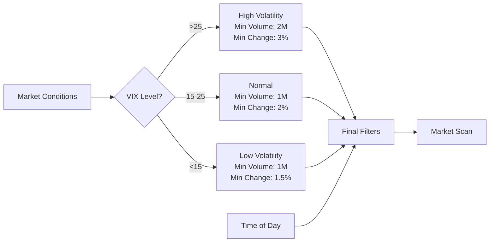
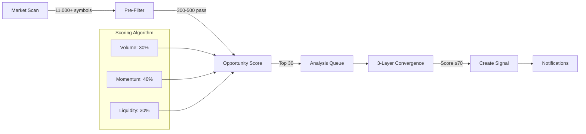

# THub V2 n8n Workflow Architecture

## System Overview



## Detailed Workflow Interactions

### 1. Market Scanning Flow



### 2. Adaptive Filter Logic



### 3. Signal Quality Pipeline



## Workflow Configurations

### Market Scanner Settings

| Parameter | Default | High Volatility | Pre-Market |
|-----------|---------|----------------|------------|
| Min Volume | 1M | 2M | 500K |
| Min Price | $5 | $5 | $5 |
| Max Price | $500 | $500 | $500 |
| Min Change | 2% | 3% | 5% |
| Scan Limit | 30 | 50 | 20 |
| Schedule | */30 9-16 * * 1-5 | Same | 30 8 * * 1-5 |

### Quality Control Thresholds

| Check | Threshold | Action |
|-------|-----------|---------|
| Max Daily Change | 100% | Filter out |
| Min Volume | 10,000 | Filter out |
| Min Price | $1 | Filter out |
| Volume Spike | 50x normal | Flag for review |
| Missing Data | Any required field | Skip symbol |

## Performance Metrics

### Target KPIs

```yaml
Operational:
  - Scan Completion: < 4 minutes
  - Error Rate: < 5%
  - API Usage: < 80% of limit
  - Uptime: > 99%

Quality:
  - Candidates per Scan: 20-30
  - Signals per Run: 3-5
  - Signal Accuracy: > 70%
  - False Positive Rate: < 20%

Efficiency:
  - Scan-to-Signal: < 10 minutes
  - Notification Delay: < 30 seconds
  - Database Writes: < 1000/scan
```

## Data Flow Examples

### Example 1: High-Value Signal Discovery

```
Time: 10:30 AM
Market Condition: VIX = 28 (High Volatility)

1. Scanner applies strict filters:
   - Min Volume: 2,000,000
   - Min Change: 3%
   - Limit: 50 candidates

2. Discovers BMNR:
   - Price: $3.85
   - Volume: 48M (vs 376K avg)
   - Change: +126%
   - Opportunity Score: 73

3. Analysis triggered:
   - Technical Score: 82
   - Sentiment Score: 68
   - Liquidity Score: 71
   - Convergence: 74 (STRONG)

4. Signal created and notification sent
```

### Example 2: Pre-Market Gap Detection

```
Time: 8:30 AM
Scan Type: Pre-Market Gaps

1. Scanner finds 15 gaps > 5%
2. Categorizes:
   - 2 Extreme gaps (>10%)
   - 5 Strong gaps (5-10%)
   - 8 Moderate gaps (3-5%)

3. Priority analysis on extreme gaps
4. Alerts sent before market open
```

## Monitoring Dashboard Layout

```
┌─────────────────────────────────────────────────────┐
│                  Daily Summary                       │
├─────────────────┬───────────────┬──────────────────┤
│ Total Scans: 16 │ Candidates: 412│ Signals: 42     │
│ Success: 94%    │ Avg Time: 3.2s │ Strong: 12      │
└─────────────────┴───────────────┴──────────────────┘

┌─────────────────────────────────────────────────────┐
│                 Execution Timeline                   │
│  9:30 ████ 10:00 ████ 10:30 ████ 11:00 ███▓      │
│  ✓✓✓✓     ✓✓✓✓      ✓✓✓✓      ✓✓✓✗              │
└─────────────────────────────────────────────────────┘

┌─────────────────────────────────────────────────────┐
│                  Quality Metrics                     │
├─────────────────────────┬───────────────────────────┤
│ Scan→Signal Rate: 10.2% │ API Usage: 44.5%         │
│ Avg Score: 72.3         │ Error Rate: 1.8%         │
│ High-Value Ratio: 28.6% │ Filter Effect: 85%       │
└─────────────────────────┴───────────────────────────┘
```

## Security Considerations

1. **Authentication**: All webhook calls use Bearer token
2. **Rate Limiting**: Built into THub V2 API
3. **Data Privacy**: No sensitive data in logs
4. **Error Handling**: Failures don't expose system details
5. **Access Control**: n8n credentials are encrypted

## Scaling Considerations

### Current Capacity
- Handles 11,000+ symbols per scan
- Processes in ~3.3 seconds
- Supports 48 scans/day (every 30 min)

### Future Scaling Options
1. **Horizontal**: Multiple n8n instances for different markets
2. **Vertical**: Increase batch processing size
3. **Caching**: Redis layer for frequently accessed data
4. **Queue**: Separate queue service for high volume

## Maintenance Windows

Recommended maintenance schedule:
- **Daily**: 5:00-5:30 AM EST (before pre-market)
- **Weekly**: Sunday evening
- **Monthly**: First Sunday of month

During maintenance:
1. Disable all schedules
2. Backup workflow configurations
3. Clear execution history > 30 days
4. Update n8n if needed
5. Test workflows before re-enabling

---

This architecture is designed for reliability, scalability, and continuous improvement through adaptive filtering and performance tracking.